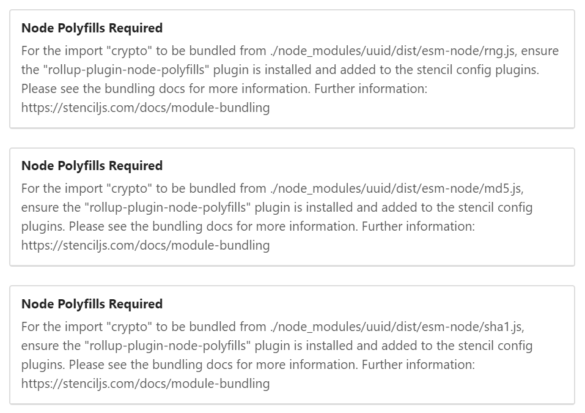
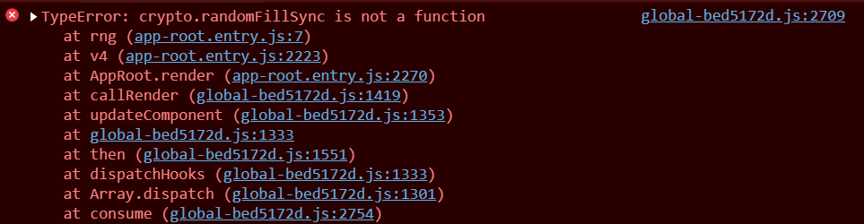

# Stencil Polyfills UUID Issue

## Misc info

Node 14.7.0

```
"@stencil/core": "^1.17.2",
"rollup-plugin-node-polyfills": "^0.2.1",
"uuid": "^8.3.0"
```


## The issue

Attempting to use 'uuid' like this:

```typescript
import { v4 } from 'uuid';

v4();
```

Initially displayed the **Node Polyfills Required**.



Note its using:

`./node_modules/uuid/dist/esm-node/rng.js`

but there is also:

`./node_modules/uuid/dist/esm-browser/rng.js`

After setting up 'rollup-plugin-node-polyfills', this error happens in windows:



But runs fine in WSL2.

=====================================

I've included the build results from both into the folders: `/www-windows` and `/www-wsl2`

You can compare the two results using:

`npm run serve:windows`

or

`npm run serve:wsl2`